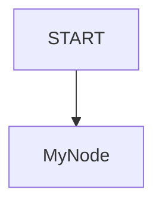

# ADK Sample Creator

This skill helps you create new samples for the ADK Python repository. You should search for subdirectories under `contributing` (such as `new_workflow_samples`, `workflow_samples`, etc.) and confirm with the user which folder they want to use before creating the sample.

> [!TIP]

> Before creating samples, you can use the `adk-style` skill to learn about ADK 2.0 architecture knowledge and best practices.

A sample consists of:

1.  A directory per sample.
2.  An `agent.py` file defining the agent or workflow logic.
3.  A `README.md` file explaining the sample.

## Guidelines

### 1. Folder Name

Use snake_case for the folder name (e.g., `dynamic_nodes`, `fan_out_fan_in`).

### 2. `agent.py` Content

The `agent.py` should focus on demonstrating a specific feature or agent pattern. Use absolute imports for testing convenience.

> [!IMPORTANT]
> **Model Selection**: Do not set the `model` parameter explicitly (e.g., `model="gemini-2.5-flash"`) on `Agent` instances in sample agents. Instead, let them default to the system-configured model, unless a specific model is explicitly requested by the user.

Choose one of the following patterns:

#### Pattern A: Workflows (for complex graphs)

Use this when you need multiple nodes, routing, or parallel execution.

**Imports:**

```python
from google.adk import Agent
from google.adk import Context
from google.adk.workflow import node
from google.adk.workflow import JoinNode
from google.adk.workflow._workflow_class import Workflow
```

**Anatomy:**

```python
my_agent = Agent(name="my_agent", ...)

@node()
async def my_node(node_input: str):
    return "result"

root_agent = Workflow(
    name="root_wf",
    edges=[("START", my_node)],
)
```

#### Pattern B: Standalone Agents (for single-agent or simple tool use)

Use this when you don't need a graph and the agent handles the loop.

**Imports:**

```python
from google.adk import Agent
from google.adk.tools import google_search  # example
```

**Anatomy:**

```python
root_agent = Agent(
    name="standalone_assistant",
    instruction="You are a helpful assistant.",
    description="An assistant that can help with queries.",
    tools=[google_search],
)
```

### 3. `README.md` Content

Each sample should have a `README.md` with the following structure:

- **Overview**: What the sample does.
- **Sample Inputs**: Examples of inputs to test with. Each prompt must be wrapped in backticks. If a prompt has an explanation, always add a blank line between the prompt and the explanation, and indent the explanation by two spaces.
- **Graph**: Visualization of the graph flow (Mermaid recommended for workflows).
- **How To**: Explanation of key techniques used (e.g., `ctx.run_node`).

#### README Example Template:

````markdown
# ADK Sample Name

## Overview

Brief description.

## Sample Inputs

- `Prompt example 1`

- `Prompt example 2`

  *Explanation or expected behavior*

## Graph



````

## How To

Explain the details.

````

## Examples

### Dynamic Nodes
Snippet from `dynamic_nodes/agent.py`:
```python
@node(rerun_on_resume=True)
async def orchestrate(ctx: Context, node_input: str) -> str:
    while True:
        headline = await ctx.run_node(generate_headline)
        # ...
````

### Fan Out Fan In

Snippet from `fan_out_fan_in/agent.py`:

```python
root_agent = Workflow(
    name="root_agent",
    edges=[("START", (node_a, node_b), join_node, aggregate)],
)
```
