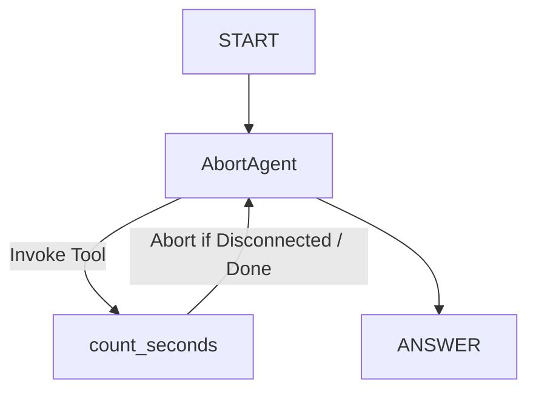

# Abort Agent Sample

## Overview

This sample demonstrates a standalone ADK agent designed specifically to showcase cooperative task cancellation on client disconnections.

The agent leverages a custom tool that counts from 1 to a target number requested by the user, pausing 1 second between each count and printing the progress directly to the server's stdout terminal. This delay allows you to easily trigger connection drops (by cancelling client requests mid-execution) and visually observe that background agent execution halts immediately in the server terminal, resolving resource leaks.

## Sample Inputs

- `Count to 10 seconds`

  The agent will call the `count_seconds` tool with a target count of 10, pausing 1 second between each increment.

- `Please count up to 20`

  The agent will invoke the tool to count to 20. If you close the client connection (such as pressing `Ctrl+C` in a cURL window or closing your browser tab) while the loop is running, counting halts immediately.

## Graph



## How To

### 1. Running Locally via the CLI

To interact with the agent in your local shell terminal:

```bash
adk run contributing/samples/core/abort/
```

Type `count to 10` at the `[user]:` prompt. Pressing `Ctrl+C` mid-run will abort counting and exit.

### 2. Running via HTTP Server and cURL

To verify connection-drop abortion over network protocols (e.g. simple HTTP REST request):

1. Start the local development server to watch the sample workspace:
   ```bash
   adk web --allow_origins=http://localhost:4200 contributing/samples/
   ```
1. In a separate terminal, register the test session (local CLI development servers run with `--auto_create_session` set to `False` by default):
   ```bash
   curl -X POST http://localhost:8000/apps/abort_agent/users/user/sessions \
     -H "Content-Type: application/json" \
     -d '{"session_id": "8b24e6ed-1fff-4f0c-a06a-e065692a446e"}'
   ```
1. Initiate the count request (this blocks waiting for a response):
   ```bash
   curl -X POST http://localhost:8000/run \
     -H "Content-Type: application/json" \
     -d '{
       "app_name": "abort_agent",
       "user_id": "user",
       "session_id": "8b24e6ed-1fff-4f0c-a06a-e065692a446e",
       "new_message": {
         "role": "user",
         "parts": [{"text": "count to 100"}]
       }
     }'
   ```
1. Observe your `adk web` terminal window. You will see the counting progress logging.
1. **Trigger the Abort**: Press `Ctrl+C` in your cURL terminal window to close the client connection.
1. Observe the server console window. Counting halts instantly and prints:
   ```text
   [Counting Tool] Count was ABORTED mid-run at progress: X/100 (Client Disconnected)!
   ```

### 3. Running and Testing via ADK Web (Dev UI)

To observe cooperative aborts interactively in the web-based developer interface:

1. Start the local development server:
   ```bash
   adk web --allow_origins=http://localhost:4200 contributing/samples/
   ```
1. Open the ADK Web interface (`http://localhost:4200`) in your web browser.
1. Select the **`abort_agent`** app from the left sidebar panel.
1. Type `count to 100` in the message input box and click submit.
1. **Trigger the Abort**: Simply close your browser tab, refresh the page, or navigate away from the chat panel.
1. Observe the server's stdout terminal console. You will see that counting halts immediately and logs:
   ```text
   [Counting Tool] Count was ABORTED mid-run (Client Disconnected)!
   ```
