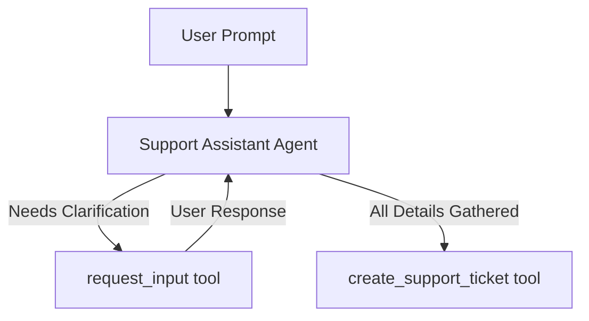

# Request Input Tool Sample

## Overview

This sample demonstrates how an LLM agent can proactively request clarification or confirmation from the user using the built-in `request_input` tool without losing its context/flow.

It showcases a highly realistic support assistant that dynamically constructs a JSON schema to only ask for missing details when creating IT support tickets.

## Sample Inputs

- `I want to file a technical ticket for a database crash.`

  The agent will analyze the prompt, identify that the `title` and `category` are already provided, and dynamically call `request_input` with a schema requesting only `description` and `priority`.

- `File a priority HIGH technical ticket titled database crash explained as the MySQL server throwing OOM errors.`

  The agent has all required details and will call `create_support_ticket` immediately without needing clarification.

## Graph



## How To

This sample uses **Pattern B: Standalone Agents** with the `request_input` tool:

1. **Import `request_input`**:

   ```python
   from google.adk.tools import request_input
   ```

1. **Add it to the LLM Agent's tools list**:

   ```python
   root_agent = Agent(
       name="support_assistant_agent",
       tools=[create_support_ticket, request_input],
       ...
   )
   ```

When the LLM decides it needs clarification, it calls `request_input` with a question and a dynamic `response_schema`. The ADK framework automatically intercepts this, yields a long-running interrupt to the client, and injects the user's reply back as a `FunctionResponse` into the LLM's chat history.
